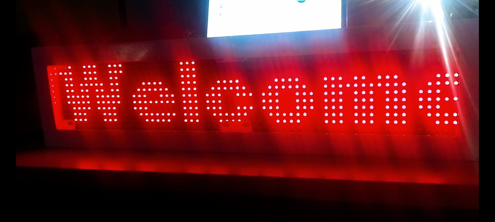

# P10 LED Display Scrolling Text (Arduino)

##  Project Overview
This project demonstrates how to control a P10 LED display using Arduino.  
It displays scrolling text with stable brightness and smooth animation using timer interrupts and PWM control.

The system uses multiplexing to refresh the display continuously, ensuring a flicker-free output.

---

##  Features
- Smooth scrolling marquee text  
- PWM-based brightness control using OE pin  
- Flicker-free display using Timer interrupt  
- Supports multiple P10 panels (2 panels used in this project)  

---

##  Concepts Used
- SPI Communication  
- Timer Interrupts  
- PWM (Pulse Width Modulation)  
- Multiplexing in LED Displays  

---

##  Hardware Required
- Arduino Uno / Nano  
- P10 LED Display Panels (2 units)  
- External 5V Power Supply (2A recommended)  
- Jumper wires  

---

##  Pin Connections

| P10 Pin | Function        | Arduino Pin |
|--------|----------------|-------------|
| A      | Row Select     | 6           |
| B      | Row Select     | 7           |
| CLK    | Clock          | 13          |
| LAT    | Latch          | 10          |
| OE     | Output Enable  | 9           |
| DATA   | Data Input     | 11          |
| GND    | Ground         | GND         |
| VCC    | Power (5V)     | External 5V |

---

##  Important Notes
- Do NOT power the P10 display directly from Arduino 5V  
- Always use an external 5V power supply  
- Make sure all grounds (Arduino + P10) are connected  

---

---

##  How It Works
- The display is refreshed continuously using a timer interrupt (`ScanDMD()`)  
- SPI is used to send data to the display  
- OE pin controls brightness using PWM  
- Text scrolls using the marquee function  

---

##  Problem Faced
During development, a dim background glow (ghosting effect) was observed on the LEDs.

---

##  Solution
The issue was resolved by:
- Implementing proper PWM-based brightness control using the OE pin  
- Using Timer interrupts to maintain consistent refresh timing  

This ensured:
- Proper ON/OFF control of LEDs  
- Stable and flicker-free display  

---

##  Output

